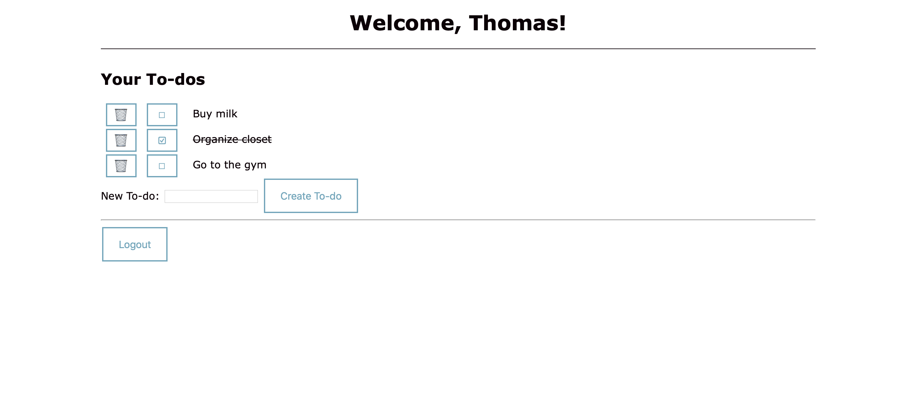

# todolist
To-do list Flask app to practice SQL using sqlite3.

## What it looks like
To-dos are listed to the user. It's simple to create a todo, mark an existing one as done, or to delete it:



## Dependencies

- Python 3.7+
- Flask
- Bcrypt

To install Flask and Bcrypt, you can run:
```zsh
pip install flask bcrypt
```

## Running locally
Make sure you have the [dependencies](#dependencies) installed.
Clone the repository:
```zsh
git clone https://github.com/thomasbreydo/todolist.git
cd ./todolist
```
If this is the first time running the app, you will need to generate a secret key for Flask:
```zsh
python -c "import os; print(f'SECRET_KEY = {os.urandom(24)}')" > ./app/secrets.py
```
Finally, run the app on http://0.0.0.0:5000:
```
./run.py
```
